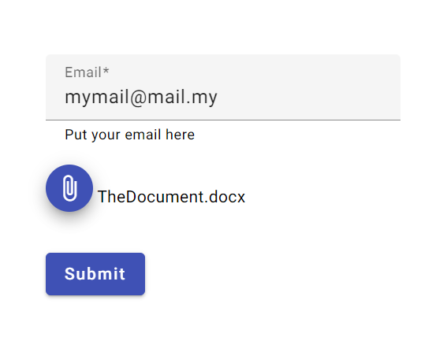

# Simple Upload File Form

Welcome to the Simple File Upload Form project! This application is designed to provide a user-friendly interface for uploading .docx files using Angular, while leveraging Azure Storage for file management and SendGrid for email notifications.

### Features
- Upload .docx files through an easy-to-use form designed with Angular Material.
- Receive email notifications upon successful file upload.
- Utilizes Azure Storage for efficient file management.
- Implemented with .NET MVC architecture for seamless integration.

#### Angular Upload Form Application

This application provides a user-friendly form for uploading .docx files. Built using Angular, the form is designed with Angular Material, ensuring a clean and modern user interface. Upon submission, the user is required to provide an email address where they will receive a notification once their file has been uploaded to Azure Storage.

#### .Net Application 
This is an MVC .NET application that receives a .docx file, checks if such a file already exists, and uploads it directly to **Azure Storage**. The wwwroot folder is filled by the Angular app before deployment to Azure.

#### Azure Function
This Azure function is triggered when a file is uploaded to Azure Storage and sends an email notification via the SendGrid service.
